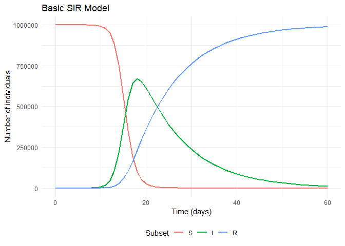
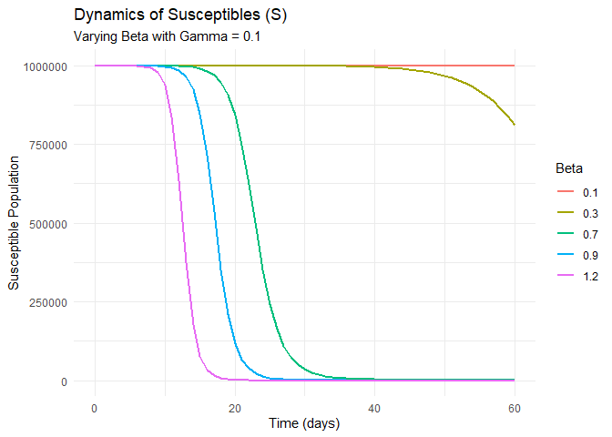
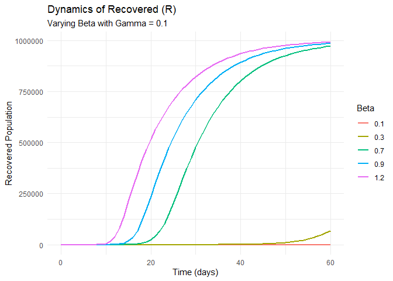
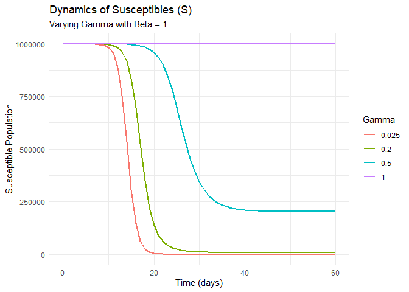
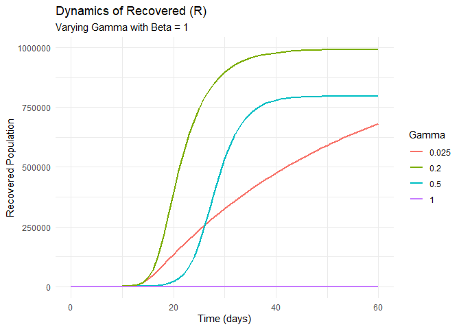

Challenge: SIR Model and Vaccination Part 1
================
Aldo Resendiz, Aldo Radamés Corral Verdugo, Virginia Díaz Moreno.
Noviembre de 2025

- [Plots of system evolution](#plots-of-system-evolution)
- [Question 1](#question-1)
- [Question 2 Reduction of
  Susceptibles](#question-2-reduction-of-susceptibles)
  - [Analytical Solution: Question 2](#analytical-solution-question-2)
  - [Interpretation:](#interpretation)
- [Question 3 Variation of $`\beta`$ (Force of
  infection)](#question-3-variation-of-beta-force-of-infection)
- [Question 4 Variation of $`\gamma`$
  (Recovery)](#question-4-variation-of-gamma-recovery)
  - [Analysis of the variability of
    $`\gamma`$](#analysis-of-the-variability-of-gamma)

``` r
knitr::opts_chunk$set(echo = TRUE, warning = FALSE, message = FALSE)
```

The SIR model

Let us consider a model to describe the dynamics of a group of
individuals in a population with exposure to a disease that can be
spread among the members of the population. This can be modeled as a
dynamic system called $`SIR`$ for a population of $`N`$ individuals
where the interaction between a set of $`S`$ susceptible individuals to
contract the disease, a set $`I`$ of infected individuals, and a set
$`R`$ of recovered individuals from the disease is considered.

This model has the following assumptions:

the probabilities of getting infected are equal for all individuals in
the population;

the population is homogeneous, meaning the risks of getting infected are
equal for all susceptibles and the times to recover are equal for all
infected; and

the population size $`N`$ is constant.

The model handles the different sets $`S`$, $`I`$, and $`R`$ as if they
were well-separated compartments and considers that individuals can pass
from one to another in the event they get sick (change
$`S\rightarrow I`$) or once sick they recover (change
$`I\rightarrow R`$). Furthermore, it is assumed that an individual
cannot pass from the susceptible set directly to the recovered set.

With these assumptions and considerations, the differential equations of
the SIR model are:

``` math
\begin{aligned}
\frac{dS}{dt}&= -\beta \frac{I}{N} S\\
\frac{dI}{dt}&= \beta\frac{I}{N}S-\gamma I\\\
\frac{dR}{dt}&= \gamma I
\end{aligned}
```

where:

N=S+R+I

the quantity $`\beta\frac{I}{N}`$ represents the rate at which people
leave compartment S (get infected);

in the first equation $`dS`$ represents the change due to people leaving
compartment $`S`$ (the negative sign is because people are leaving)

in the second equation $`dI`$ represents the change due to people
entering compartment $`I`$ (a part is due to people passing from
compartment $`S`$ to compartment $`I`$, and another part is due to
people leaving compartment $`I`$ because they recover);

the quantity $`\gamma`$ represents the rate at which people recover.

``` r
# PACKAGES:
library(deSolve)
library(reshape2)
library(ggplot2)

initial_state_values <- c(S = 999999, I = 1, R = 0)
parameters <- c(beta = 1, gamma = 0.1)
times <- seq(from = 0, to = 60, by = 1)   

sir_model <- function(time, state, parameters) {  
    with(as.list(c(state, parameters)), {
        N <- S+I+R 
        lambda <- beta * I/N
        dS <- -lambda * S                 
        dI <- lambda * S - gamma * I    
        dR <- gamma * I                   
        return(list(c(dS, dI, dR))) 
    })
}

output <- as.data.frame(ode(y = initial_state_values, 
                            times = times, 
                            func = sir_model,
                            parms = parameters))
```

# Plots of system evolution

``` r
# Base model plot
output_long <- melt(as.data.frame(output), id = "time")                   

ggplot(data = output_long, aes(x = time, y = value, colour = variable)) +  
  geom_line(linewidth = 1) +                                    
  xlab("Time (days)")+                                  
  ylab("Number of individuals") +                                      
  labs(title = "Basic SIR Model", colour = "Subset") +
  theme_minimal() +
  theme(legend.position = "bottom")
```

<!-- -->

With the SIR model, the constant

``` math
R\_0=\frac{\beta}{\gamma}
```

is defined, representing the number of people each infected person
infects. For the analyzed disease to trigger an epidemic, $`R_0 > 1`$
must be met.

Also defined is

``` math
R\_{eff}=R\_0\frac{S}{N}
```

which corresponds to the average number of people each infected person
infects. This second value $`R_{eff}`$ takes into account that during
the evolution of the pandemic, as the number of immune people in the
population increases, each infected person will infect a decreasing
number of people.

# Question 1

Analyzing the “output” dataframe, find the day when the number of
infections is maximum.

``` r
# Find the row with the maximum value of infected (I)
fila_max_I <- output[which.max(output$I), ]
dia_pico <- fila_max_I$time
max_infectados <- fila_max_I$I

cat("The peak of infections occurs on day:", dia_pico, "\n")
```

    ## The peak of infections occurs on day: 18

``` r
cat("Maximum number of infected:", round(max_infectados))
```

    ## Maximum number of infected: 669741

Analytical relationship at the maximum: To find the relationship between
the parameters at the maximum of the infection curve ($`I`$), we analyze
the differential equation of $`dI/dt`$:
``` math
 \frac{dI}{dt} = \beta \frac{I}{N} S - \gamma I
```
In the maximum point (the peak), the slope is zero ($`dI/dt = 0`$).
Then:
``` math
 0 = I \left( \beta \frac{S}{N} - \gamma \right) 
```
For this multiplication to be zero, there are two options:$`I = 0`$:
This would mean there are no infected people (which is the beginning or
the end of the epidemic, but not the
peak).$`\left( \beta \frac{S}{N} - \gamma \right) = 0`$: This is the
condition that occurs just at the peak of the curve. As $`I \neq 0`$, we
must have:
``` math
 \beta \frac{S}{N} = \gamma \implies S = \frac{\gamma}{\beta} N 
```
However, if values of $`\gamma`$ and $`\beta`$ change, the curve will be
affected so the maximum point will change.

Interpretation: The maximum of infections occurs exactly when the number
of susceptibles ($`S`$) falls to the level $`\frac{\gamma}{\beta}N`$.
From this moment on, as $`S`$ continues to decrease, the recovery rate
exceeds the infection rate and the curve begins to fall.

# Question 2 Reduction of Susceptibles

Analyzing the dataframe, find after how many days the number of
“susceptibles” is reduced to half.

``` r
S_inicial <- initial_state_values["S"]
umbral_mitad <- S_inicial / 2

# Filter times where S is already less than or equal to half
fila_mitad <- subset(output, S <= umbral_mitad)[1, ] # We take the first datum

cat("The number of susceptibles falls to half approx. on day:", fila_mitad$time, "\n")
```

    ## The number of susceptibles falls to half approx. on day: 16

``` r
cat("Value of S on that day:", round(fila_mitad$S))
```

    ## Value of S on that day: 353135

## Analytical Solution: Question 2

Objective: Find an analytical formula for the time $`t`$ necessary for
the number of susceptibles ($`S`$) to reduce to half of its initial
value ($`S_0/2`$), as a function of parameter $`\beta`$.

1.  Equation Setup We start from the differential equation for
    susceptibles of the SIR model:

``` math
\frac{dS}{dt} = -\beta \frac{I}{N} S
```

2.  Model Approximation (Reduction to SI) To solve analytically, we
    assume that in this initial phase the number of recovered is
    negligible, so the population is conserved as $`N \approx S + I`$.
    This allows us to express $`I`$ in terms of $`S`$:

``` math
I = N - S
```

Substituting in the differential equation:

``` math
\frac{dS}{dt} = -\frac{\beta}{N} (N - S) S
```

3.  Integration We separate variables ($`S`$ to the left, $`t`$ to the
    right) and integrate using partial fractions:

``` math
\int \frac{1}{S(N-S)} dS = \int -\frac{\beta}{N} dt
```

``` math
\frac{1}{N} \ln\left( \frac{S}{N-S} \right) = -\frac{\beta}{N} t + C
```

Multiplying by $`N`$, we obtain the general solution (Logistic
Equation):

``` math
\ln\left( \frac{S}{N-S} \right) = -\beta t + C'
```

4.  Initial Conditions and Resolution

At time $`t=0`$: We assume $`S_0 \approx N`$ and a very small number of
infected $`I_0`$ (e.g., 1). The integration constant results in
$`C' \approx \ln(N)`$.

Target condition: We look for time $`t`$ when
$`S = S_0 / 2 \approx N/2`$.

Substituting $`S = N/2`$ in the equation:

``` math
\ln\left( \frac{N/2}{N - N/2} \right) = -\beta t + \ln(N)
```

The logarithm term simplifies to $`\ln(1)`$, which is 0:

``` math
0 = -\beta t + \ln(N)
```

5.  Final Formula We solve for $`t`$:

``` math
t = \frac{\ln(N)}{\beta}
```

## Interpretation:

Under the assumption of an initially almost totally susceptible
population, the time it takes for the disease to infect half the
population is inversely proportional to the transmission rate $`\beta`$
and proportional to the logarithm of the population size.

# Question 3 Variation of $`\beta`$ (Force of infection)

We study the dynamics maintaining $`\gamma = 0.1`$ and varying
$`\beta`$. Values of $`\beta`$: 0.1, 0.3, 0.7, 0.9, 1.2.

``` r
betas <- c(0.1, 0.3, 0.7, 0.9, 1.2)
gamma_fijo <- 0.1
resultados_p3 <- list()

for(b in betas){
  pars <- c(beta = b, gamma = gamma_fijo)
  out <- as.data.frame(ode(y=initial_state_values, times=times, func=sir_model, parms=pars))
  out$beta <- as.factor(b)
  resultados_p3[[length(resultados_p3)+1]] <- out
}

data_p3 <- do.call(rbind, resultados_p3)

ggplot(data_p3, aes(x=time, y=I, color=beta)) +
  geom_line(size=1) +
  labs(title = "Dynamics varying Beta (Gamma = 0.1)", 
       y = "Infected", color = "Beta") +
  theme_minimal()
```

<!-- -->

``` r
ggplot(data_p3, aes(x=time, y=S, color=beta)) +
  geom_line(size=1) +
  labs(title = "Dynamics of Susceptibles (S)", 
       subtitle = "Varying Beta with Gamma = 0.1",
       y = "Susceptible Population", 
       x = "Time (days)",
       color = "Beta") +
  theme_minimal()
```

<!-- -->

``` r
ggplot(data_p3, aes(x=time, y=R, color=beta)) +
  geom_line(size=1) +
  labs(title = "Dynamics of Recovered (R)", 
       subtitle = "Varying Beta with Gamma = 0.1",
       y = "Recovered Population", 
       x = "Time (days)",
       color = "Beta") +
  theme_minimal()
```

<!-- -->

It is observed that with a force of infection $`\beta \le 0.1`$, no
effective propagation of the disease occurs. For an outbreak to start,
the value of $`\beta`$ must be in the range $`0.1 < \beta \le 0.3`$.
However, for a significant epidemic to develop, it is necessary that
$`\beta`$ be greater than $`0.7`$, regardless of the simulation
duration. On the other hand, with even higher values (e.g.,
$`\beta = 1.2`$), the infection spreads with such speed that the system
reaches its steady state much faster.

# Question 4 Variation of $`\gamma`$ (Recovery)

We study the dynamics maintaining $`\beta = 1`$ and varying $`\gamma`$.
Values of $`\gamma`$: 0.025, 0.2, 0.5, 1.

``` r
beta_fijo <- 1
gammas <- c(0.025, 0.2, 0.5, 1)
resultados_p4 <- list()

for(g in gammas){
  pars <- c(beta = beta_fijo, gamma = g)
  out <- as.data.frame(ode(y=initial_state_values, times=times, func=sir_model, parms=pars))
  out$gamma <- as.factor(g)
  resultados_p4[[length(resultados_p4)+1]] <- out
}

data_p4 <- do.call(rbind, resultados_p4)

ggplot(data_p4, aes(x=time, y=I, color=gamma)) +
  geom_line(size=1) +
  labs(title = "Dynamics varying Gamma (Beta = 1)", 
       y = "Infected", color = "Gamma") +
  theme_minimal()
```

<!-- -->

``` r
ggplot(data_p4, aes(x=time, y=S, color=gamma)) +
  geom_line(size=1) +
  labs(title = "Dynamics of Susceptibles (S)", 
       subtitle = "Varying Gamma with Beta = 1",
       y = "Susceptible Population", 
       x = "Time (days)",
       color = "Gamma") +
  theme_minimal()
```

<!-- -->

``` r
ggplot(data_p4, aes(x=time, y=R, color=gamma)) +
  geom_line(size=1) +
  labs(title = "Dynamics of Recovered (R)", 
       subtitle = "Varying Gamma with Beta = 1",
       y = "Recovered Population", 
       x = "Time (days)",
       color = "Gamma") +
  theme_minimal()
```

<!-- -->

### Analysis of the variability of $`\gamma`$

When analyzing the graphs, an inverse relationship is clearly observed
between the recovery rate $`\gamma`$ and the scope of the disease: the
lower $`\gamma`$ is (which implies a longer disease time), the greater
the number of infected people.

Particularly, in the scenario where $`\gamma = 1`$ (being
$`\beta = 1`$), we notice that no epidemic occurs. This happens because
individuals recover so fast that the disease fails to propagate
effectively. From this, we can infer the necessary condition for the
outbreak:

``` math
\beta > \gamma \iff \frac{\beta}{\gamma} > 1
```

This indicates that the disease will only spread if the transmission
rate is greater than the recovery rate. This quotient is known as the
Basic Reproductive Number ($`R_0`$), which represents the average of new
infections generated by a single infected individual during their
contagious period:

``` math
R_0 = \frac{\beta}{\gamma}
```

Based on this parameter, we can conclude:

Si $`R_0 > 1`$: The epidemic grows. Each individual infects, on average,
more than one person, allowing the pathogen expansion.

Si $`R_0 = 1`$: The disease becomes endemic or stable; each infected is
replaced by another, without exponential growth.

Si $`R_0 < 1`$: The epidemic extinguishes. Each person infects less than
one individual on average, causing the outbreak to decay rapidly.
