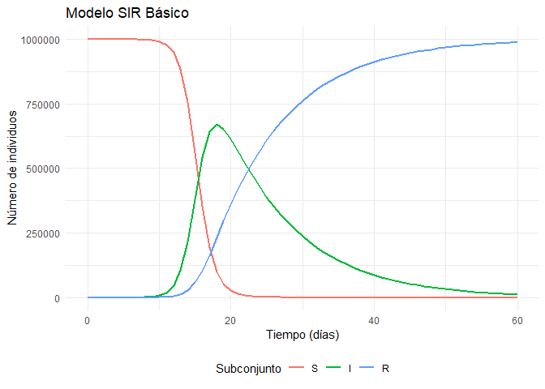
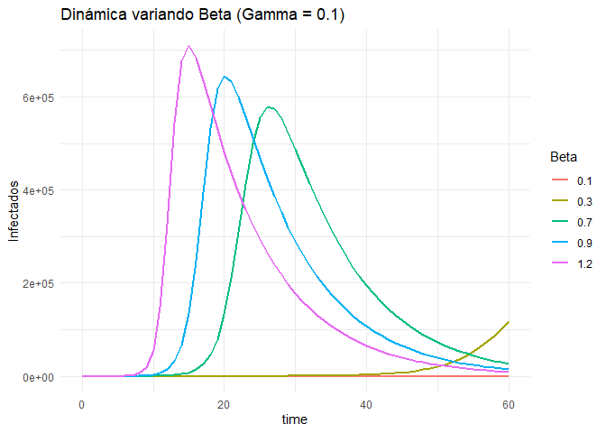
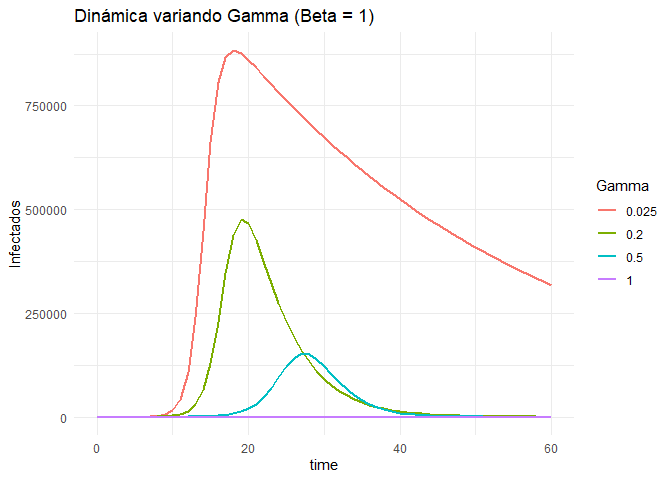
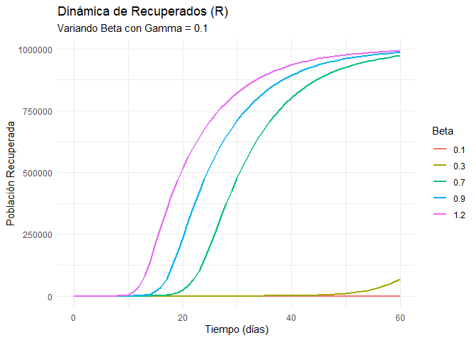
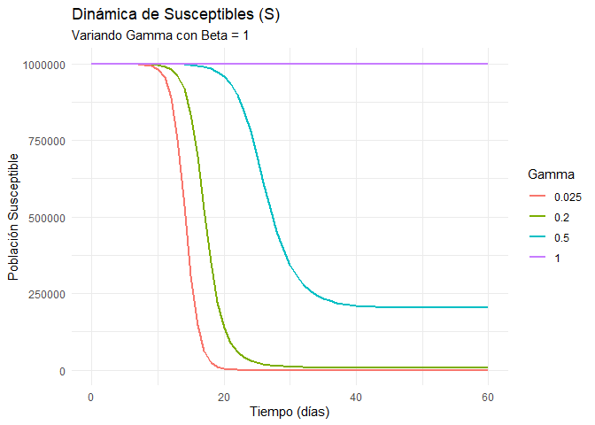
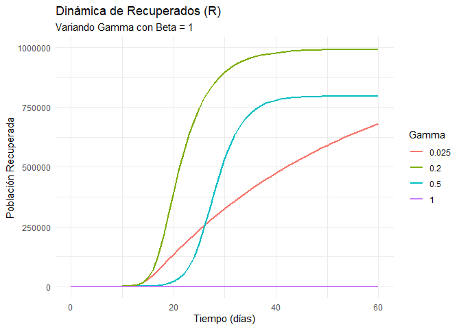

Reto: Modelo SIR y Vacunación Parte 1
================
Aldo Resendiz Cravioto, Aldo Radamés Corral Verdugo, Virginia Díaz
Moreno.
Noviembre de 2025

- [El modelo SIR](#el-modelo-sir)
- [Gráficos de la evolución del
  sistema](#gráficos-de-la-evolución-del-sistema)
- [Pregunta 2 Reducción de
  Susceptibles](#pregunta-2-reducción-de-susceptibles)
  - [Solución Analítica: Pregunta 2](#solución-analítica-pregunta-2)
- [Pregunta 3 Variación de $`\beta`$ (Fuerza de
  infección)](#pregunta-3-variación-de-beta-fuerza-de-infección)
- [Pregunta 4 Variación de $`\gamma`$
  (Recuperación)](#pregunta-4-variación-de-gamma-recuperación)
  - [Análisis de la variabilidad de
    $`\gamma`$](#análisis-de-la-variabilidad-de-gamma)

## El modelo SIR

Consideremos un modelo para describir la dinámica de un grupo de
individuos de una población con exposición a una enfermedad que puede
contagiarse entre los miembros de la población. Esto puede modelarse
como un sistema dinámico denominado $`SIR`$ para una población de $`N`$
individuos en la que se considera la interacción entre un conjunto de
$`S`$ individuos *suceptibles* de contraer la enfermedad, un conjunto
$`I`$ de individuos *infectados* y uno conjunto $`R`$ de individuos
*recuperados* de la enfermedad.

Este modelo tiene los siguientes supuestos:

- la probabilidades de infectarse son iguales para todos los individuos
  de la población;

- la población es homogénea, es decir que los riesgos de infectarse son
  iguales para toos los suceptibles y que los tiempos para recuperarse
  son iguales para todos los infectados; y

- el tamaño $`N`$ de la población es constante.

El modelo maneja los diferentes conjuntos $`S`$, $`I`$ y $`R`$ como si
fueran compartimentos bien separados y considera que los individuos
pueden pasr de uno a otro en el caso de que se enfermen (cambio
$`S\rightarrow I`$) o que una vez enfermos se recuperen (cambio
$`I\rightarrow`$). Ademas, se asume que un individuo no puede pasar del
conjunto de suceptibles directamente al conjunto de recuperados.

Con estos supuestos y consideraciones, las ecuaciones diferenciales del
modelo SIR son:
``` math

\begin{aligned}
\frac{dS}{dt}&= -\beta \frac{I}{N} S\\
\frac{dI}{dt}&= \beta\frac{I}{N}S-\gamma I\\\
\frac{dR}{dt}&= \gamma I
\end{aligned}
```
donde:

- N=S+R+I

- la cantidad $`\beta\frac{I}{N}`$ representa la razón con que las
  personas salen del compartimento S (se infectan);

- en la primera ecuación $`dS`$ representa el cambio debido a las
  personas que salen del compartimento $`S`$ (el signo negativo se debe
  a que las personas salen)

- en la segunda ecuación $`dI`$ representa el cambio debido a las
  personas que salen del compartimento $`I`$ (una parte se debe a las
  personas que del compartimento $`S`$ pasan al compartimento $`I`$, y
  otra parte se debe a las personas que salen del compartimento $`I`$
  porque se recuperan);

- la cantidad $`\gamma`$ representa la razón con que las personas se
  recuperan.

``` r
# PACKAGES:
library(deSolve)
library(reshape2)
library(ggplot2)

initial_state_values <- c(S = 999999, I = 1, R = 0)
parameters <- c(beta = 1, gamma = 0.1)
times <- seq(from = 0, to = 60, by = 1)   

sir_model <- function(time, state, parameters) {  
    with(as.list(c(state, parameters)), {
        N <- S+I+R 
        lambda <- beta * I/N
        dS <- -lambda * S                
        dI <- lambda * S - gamma * I   
        dR <- gamma * I                  
        return(list(c(dS, dI, dR))) 
    })
}

output <- as.data.frame(ode(y = initial_state_values, 
                            times = times, 
                            func = sir_model,
                            parms = parameters))
```

## Gráficos de la evolución del sistema

``` r
# Gráfico del modelo base
output_long <- melt(as.data.frame(output), id = "time")                  

ggplot(data = output_long, aes(x = time, y = value, colour = variable)) +  
  geom_line(linewidth = 1) +                                           
  xlab("Tiempo (días)")+                                         
  ylab("Número de individuos") +                                       
  labs(title = "Modelo SIR Básico", colour = "Subconjunto") +
  theme_minimal() +
  theme(legend.position = "bottom")
```

<!-- --> \##
Pregunta 1 Analizando el dataframe “output” encuentre el día en que el
número de contagios es máximo.

``` r
# Encontrar la fila con el valor máximo de infectados (I)
fila_max_I <- output[which.max(output$I), ]
dia_pico <- fila_max_I$time
max_infectados <- fila_max_I$I

cat("El pico de contagios ocurre en el día:", dia_pico, "\n")
```

    ## El pico de contagios ocurre en el día: 18

``` r
cat("Número máximo de infectados:", round(max_infectados))
```

    ## Número máximo de infectados: 669741

*Relación analítica en el máximo*:Para encontrar la relación entre los
parámetros en el máximo de la curva de infección ($`I`$), analizamos la
ecuación diferencial de $`dI/dt`$:
``` math
 \frac{dI}{dt} = \beta \frac{I}{N} S - \gamma I 
```
En el punto máximo (el pico), la pendiente es cero ($`dI/dt = 0`$).
Entonces:
``` math
 0 = I \left( \beta \frac{S}{N} - \gamma \right) 
```
Para que esta multiplicación sea igual a cero, hay dos
opciones:$`I = 0`$: Esto significaría que no hay infectados (lo cual es
el inicio o el fin de la epidemia, pero no el
pico).$`\left( \beta \frac{S}{N} - \gamma \right) = 0`$: Esta es la
condición que ocurre justo en el pico de la curva. Como $`I \neq 0`$,
debemos tener:
``` math
 \beta \frac{S}{N} = \gamma \implies S = \frac{\gamma}{\beta} N 
```
Sin embargo, si los valores de $`\gamma`$ y $`\beta`$ cambian, se verá
afectada la curva por lo que el punto máximo cambiará

**Interpretación:** El máximo de contagios ocurre exactamente cuando el
número de susceptibles ($`S`$) cae hasta el nivel
$`\frac{\gamma}{\beta}N`$. A partir de este momento, como $`S`$ sigue
disminuyendo, la tasa de recuperación supera a la de infección y la
curva comienza a bajar.

## Pregunta 2 Reducción de Susceptibles

Analizando el dataframe encuentre después de cuántos días el número de
“susceptibles” se reduce a la mitad.

``` r
S_inicial <- initial_state_values["S"]
umbral_mitad <- S_inicial / 2

# Filtrar los tiempos donde S ya es menor o igual a la mitad
fila_mitad <- subset(output, S <= umbral_mitad)[1, ] # Tomamos el primer dato

cat("El número de susceptibles cae a la mitad aprox. en el día:", fila_mitad$time, "\n")
```

    ## El número de susceptibles cae a la mitad aprox. en el día: 16

``` r
cat("Valor de S en ese día:", round(fila_mitad$S))
```

    ## Valor de S en ese día: 353135

### Solución Analítica: Pregunta 2

**Objetivo:** Encontrar una fórmula analítica para el tiempo $`t`$
necesario para que el número de susceptibles ($`S`$) se reduzca a la
mitad de su valor inicial ($`S_0/2`$), en función del parámetro
$`\beta`$.

**1. Planteamiento de la Ecuación** Partimos de la ecuación diferencial
para los susceptibles del modelo SIR:
``` math
\frac{dS}{dt} = -\beta \frac{I}{N} S
```

**2. Aproximación del Modelo (Reducción a SI)** Para resolver
analíticamente, asumimos que en esta fase inicial el número de
recuperados es despreciable, por lo que la población se conserva como
$`N \approx S + I`$. Esto nos permite expresar $`I`$ en términos de
$`S`$:
``` math
I = N - S
```

Sustituyendo en la ecuación diferencial:
``` math
\frac{dS}{dt} = -\frac{\beta}{N} (N - S) S
```

**3. Integración** Separamos las variables ($`S`$ a la izquierda, $`t`$
a la derecha) e integramos usando fracciones parciales:
``` math
\int \frac{1}{S(N-S)} dS = \int -\frac{\beta}{N} dt
```

``` math
\frac{1}{N} \ln\left( \frac{S}{N-S} \right) = -\frac{\beta}{N} t + C
```

Multiplicando por $`N`$, obtenemos la solución general (Ecuación
Logística):
``` math
\ln\left( \frac{S}{N-S} \right) = -\beta t + C'
```

**4. Condiciones Iniciales y Resolución** \* **Al tiempo $`t=0`$:**
Asumimos $`S_0 \approx N`$ y un número muy pequeño de infectados $`I_0`$
(ej. 1). La constante de integración resulta $`C' \approx \ln(N)`$. \*
**Condición objetivo:** Buscamos el tiempo $`t`$ cuando
$`S = S_0 / 2 \approx N/2`$.

Sustituyendo $`S = N/2`$ en la ecuación:
``` math
\ln\left( \frac{N/2}{N - N/2} \right) = -\beta t + \ln(N)
```

El término del logaritmo se simplifica a $`\ln(1)`$, que es 0:
``` math
0 = -\beta t + \ln(N)
```

**5. Fórmula Final** Despejamos $`t`$:

``` math
t = \frac{\ln(N)}{\beta}
```

> **Interpretación:** Bajo el supuesto de una población inicialmente
> casi totalmente susceptible, el tiempo que tarda la enfermedad en
> infectar a la mitad de la población es inversamente proporcional a la
> tasa de transmisión $`\beta`$ y proporcional al logaritmo del tamaño
> de la población.

## Pregunta 3 Variación de $`\beta`$ (Fuerza de infección)

Estudiamos la dinámica manteniendo $`\gamma = 0.1`$ y variando
$`\beta`$.Valores de $`\beta`$: 0.1, 0.3, 0.7, 0.9, 1.2.

``` r
betas <- c(0.1, 0.3, 0.7, 0.9, 1.2)
gamma_fijo <- 0.1
resultados_p3 <- list()

for(b in betas){
  pars <- c(beta = b, gamma = gamma_fijo)
  out <- as.data.frame(ode(y=initial_state_values, times=times, func=sir_model, parms=pars))
  out$beta <- as.factor(b)
  resultados_p3[[length(resultados_p3)+1]] <- out
}

data_p3 <- do.call(rbind, resultados_p3)

ggplot(data_p3, aes(x=time, y=I, color=beta)) +
  geom_line(size=1) +
  labs(title = "Dinámica variando Beta (Gamma = 0.1)", 
       y = "Infectados", color = "Beta") +
  theme_minimal()
```

<!-- -->

``` r
ggplot(data_p3, aes(x=time, y=S, color=beta)) +
  geom_line(size=1) +
  labs(title = "Dinámica de Susceptibles (S)", 
       subtitle = "Variando Beta con Gamma = 0.1",
       y = "Población Susceptible", 
       x = "Tiempo (días)",
       color = "Beta") +
  theme_minimal()
```

<!-- -->

``` r
ggplot(data_p3, aes(x=time, y=R, color=beta)) +
  geom_line(size=1) +
  labs(title = "Dinámica de Recuperados (R)", 
       subtitle = "Variando Beta con Gamma = 0.1",
       y = "Población Recuperada", 
       x = "Tiempo (días)",
       color = "Beta") +
  theme_minimal()
```

<!-- -->

Se observa que con una fuerza de infección $`\beta \le 0.1`$, no ocurre
ninguna propagación efectiva de la enfermedad. Para que inicie un brote,
el valor de $`\beta`$ debe encontrarse en el rango
$`0.1 < \beta \le 0.3`$. Sin embargo, para que se desarrolle una
**epidemia significativa**, es necesario que $`\beta`$ sea mayor a
$`0.7`$, sin importar la duración de la simulación. Por otra parte, con
valores aún mayores (p. ej. $`\beta = 1.2`$), la infección se propaga
con tal velocidad que el sistema alcanza su estado estable mucho más
rápido.

## Pregunta 4 Variación de $`\gamma`$ (Recuperación)

Estudiamos la dinámica manteniendo $`\beta = 1`$ y variando
$`\gamma`$.Valores de $`\gamma`$: 0.025, 0.2, 0.5, 1.

``` r
beta_fijo <- 1
gammas <- c(0.025, 0.2, 0.5, 1)
resultados_p4 <- list()

for(g in gammas){
  pars <- c(beta = beta_fijo, gamma = g)
  out <- as.data.frame(ode(y=initial_state_values, times=times, func=sir_model, parms=pars))
  out$gamma <- as.factor(g)
  resultados_p4[[length(resultados_p4)+1]] <- out
}

data_p4 <- do.call(rbind, resultados_p4)

ggplot(data_p4, aes(x=time, y=I, color=gamma)) +
  geom_line(size=1) +
  labs(title = "Dinámica variando Gamma (Beta = 1)", 
       y = "Infectados", color = "Gamma") +
  theme_minimal()
```

<!-- -->

``` r
ggplot(data_p4, aes(x=time, y=S, color=gamma)) +
  geom_line(size=1) +
  labs(title = "Dinámica de Susceptibles (S)", 
       subtitle = "Variando Gamma con Beta = 1",
       y = "Población Susceptible", 
       x = "Tiempo (días)",
       color = "Gamma") +
  theme_minimal()
```

<!-- -->

``` r
ggplot(data_p4, aes(x=time, y=R, color=gamma)) +
  geom_line(size=1) +
  labs(title = "Dinámica de Recuperados (R)", 
       subtitle = "Variando Gamma con Beta = 1",
       y = "Población Recuperada", 
       x = "Tiempo (días)",
       color = "Gamma") +
  theme_minimal()
```

<!-- -->

### Análisis de la variabilidad de $`\gamma`$

Al analizar las gráficas, se observa claramente una relación inversa
entre la tasa de recuperación $`\gamma`$ y el alcance de la enfermedad:
mientras menor es $`\gamma`$ (lo que implica un tiempo de enfermedad más
largo), mayor es el número de personas infectadas.

Particularmente, en el escenario donde $`\gamma = 1`$ (siendo
$`\beta = 1`$), notamos que **no ocurre una epidemia**. Esto sucede
porque los individuos se recuperan tan rápido que la enfermedad no logra
propagarse eficazmente. De esto podemos inferir la condición necesaria
para el brote:

``` math
\beta > \gamma \iff \frac{\beta}{\gamma} > 1
```

Esto indica que la enfermedad solo se propagará si la **tasa de
transmisión** es mayor que la **tasa de recuperación**. A este cociente
se le conoce como **Número Reproductivo Básico ($`R_0`$)**, el cual
representa el promedio de nuevas infecciones generadas por un solo
individuo infectado durante su periodo contagioso:

``` math
R_0 = \frac{\beta}{\gamma}
```

Basándonos en este parámetro, podemos concluir: \* **Si $`R_0 > 1`$:**
La epidemia crece. Cada individuo infecta, en promedio, a más de una
persona, permitiendo la expansión del patógeno. \* **Si $`R_0 = 1`$:**
La enfermedad se vuelve endémica o estable; cada infectado es
reemplazado por otro, sin crecimiento exponencial. \* **Si
$`R_0 < 1`$:** La epidemia se extingue. Cada persona infecta a menos de
un individuo en promedio, causando que el brote decaiga rápidamente.
