Challenge: SIR Model and Vaccination Part 2
================
Aldo Resendiz, Aldo Radamés Corral Verdugo, Virginia Díaz Moreno.
November 2025

- [The SIR model](#the-sir-model)
- [Plots of system evolution](#plots-of-system-evolution)
- [Question 1](#question-1)
  - [Analysis of Results: Model with Vital
    Dynamics](#analysis-of-results-model-with-vital-dynamics)
- [Question 2](#question-2)
- [Question 3](#question-3)
- [Question 4](#question-4)

``` r
#install.packages("plotly") # If you dont have it
library(plotly)
```

## The SIR model

Let us consider a model to describe the dynamics of a group of
individuals in a population with exposure to a disease that can be
spread among the members of the population. This can be modeled as a
dynamic system called $`SIR`$ for a population of $`N`$ individuals
where the interaction between a set of $`S`$ susceptible individuals to
contract the disease, a set $`I`$ of infected individuals, and a set
$`R`$ of recovered individuals from the disease is considered.

This model has the following assumptions:

the probabilities of getting infected are equal for all individuals in
the population;

the population is homogeneous, meaning the risks of getting infected are
equal for all susceptibles and the times to recover are equal for all
infected; and

the population size $`N`$ is constant.

The model handles the different sets $`S`$, $`I`$, and $`R`$ as if they
were well-separated compartments and considers that individuals can pass
from one to another in the event they get sick (change
$`S\rightarrow I`$) or once sick they recover (change
$`I\rightarrow R`$). Furthermore, it is assumed that an individual
cannot pass from the susceptible set directly to the recovered set.

With these assumptions and considerations, the differential equations of
the SIR model are:

``` math
\begin{aligned}
\frac{dS}{dt}&= -\beta \frac{I}{N} S\\
\frac{dI}{dt}&= \beta\frac{I}{N}S-\gamma I\\\
\frac{dR}{dt}&= \gamma I
\end{aligned}
```

where:

N=S+R+I

the quantity $`\beta\frac{I}{N}`$ represents the rate at which people
leave compartment S (get infected);

in the first equation $`dS`$ represents the change due to people leaving
compartment $`S`$ (the negative sign is because people are leaving)

in the second equation $`dI`$ represents the change due to people
entering compartment $`I`$ (a part is due to people passing from
compartment $`S`$ to compartment $`I`$, and another part is due to
people leaving compartment $`I`$ because they recover);

the quantity $`\gamma`$ represents the rate at which people recover.

``` r
# PACKAGES:
library(deSolve)
library(reshape2)
library(ggplot2)

initial_state_values <- c(S = 999999, I = 1, R = 0)
parameters <- c(beta = 1, gamma = 0.1)
times <- seq(from = 0, to = 60, by = 1)   

sir_model <- function(time, state, parameters) {  
    with(as.list(c(state, parameters)), {
        N <- S+I+R 
        lambda <- beta * I/N
        dS <- -lambda * S                 
        dI <- lambda * S - gamma * I    
        dR <- gamma * I                   
        return(list(c(dS, dI, dR))) 
    })
}

output <- as.data.frame(ode(y = initial_state_values, 
                            times = times, 
                            func = sir_model,
                            parms = parameters))
```

## Plots of system evolution

``` r
# Base model plot
output_long <- melt(as.data.frame(output), id = "time")                   

ggplot(data = output_long, aes(x = time, y = value, colour = variable)) +  
  geom_line(linewidth = 1) +                                    
  xlab("Time (days)")+                                  
  ylab("Number of individuals") +                                      
  labs(title = "Basic SIR Model", colour = "Subset") +
  theme_minimal() +
  theme(legend.position = "bottom")
```

<!-- -->

With the SIR model, the constant
``` math
R_0=\frac{\beta}{\gamma}
```
is defined, representing the number of people each infected person
infects. For the analyzed disease to trigger an epidemic, $`R_0 > 1`$
must be met.

Also defined is
``` math
R_{eff}=R_0\frac{S}{N}
```
which corresponds to the average number of people each infected person
infects. This second value $`R_{eff}`$ takes into account that during
the evolution of the pandemic, as the number of immune people in the
population increases, each infected person will infect a decreasing
number of people.

## Question 1

Make changes to the model to take into account the fact that the
population is not constant:

add an increment term in $`dS`$ to take into account born individuals
$`+bN`$

add a decrement term in $`dS`$ to take into account susceptible people
who die -$`\mu S`$

add a decrement term in $`dI`$ to take into account infected people who
die -$`\mu I`$

add a decrement term in $`dR`$ to take into account recovered people who
die $`-\mu R`$

Now use the parameters
``` math

\begin{aligned}
\beta  &=  0.4 days^{-1} &= (0.4 \times 365) years^{-1}\\
\gamma &=  0.2 days^{-1} &= (0.2 \times 365) years^{-1}\\
\mu    &=  \frac{1}{70}years^{-1}\\
b     &=  \frac{1}{70}years^{-1}\\
\end{aligned}
```
and consider a duration of 1 year.

``` r
# Unit conversion to days
mu_val <- (1/70)/365
b_val  <- (1/70)/365

parameters_p1 <- c(beta = 0.4, gamma = 0.2, mu = mu_val, b = b_val)
times_p1 <- seq(0, 365, by = 1) # 1 year

# SIR function with vital dynamics
sir_vital_dynamics <- function(time, state, parameters) {
  with(as.list(c(state, parameters)), {
    N <- S + I + R
    lambda <- beta * I / N
    
    # Modified equations
    dS <- b * N - lambda * S - mu * S
    dI <- lambda * S - gamma * I - mu * I
    dR <- gamma * I - mu * R
    
    return(list(c(dS, dI, dR)))
  })
}

output_p1 <- as.data.frame(ode(y = initial_state_values, times = times_p1, func = sir_vital_dynamics, parms = parameters_p1))

# Plot
ggplot(melt(output_p1, id="time"), aes(x=time, y=value, col=variable)) +
  geom_line(linewidth=1) +
  theme_minimal() +
  labs(title = "Model with Vital Dynamics (1 year)", y="Population")
```

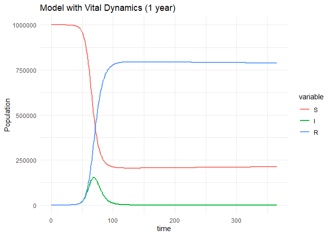<!-- -->

### Analysis of Results: Model with Vital Dynamics

The inclusion of births ($`b`$) and deaths ($`\mu`$) transforms the
behavior of the system:

*Susceptibles* ($`S`$): After the initial drop due to the outbreak, the
curve does not continue to descend indefinitely, but stabilizes. This
occurs because births ($`+bN`$) constantly replenish the susceptible
population.

*Infected* ($`I`$): The classic epidemic peak is observed, but the curve
does not fall to absolute zero. It stays at a low and stable level,
allowing the virus to persist in the population (endemic) by always
having new hosts available.

*Recovered* ($`R`$): They increase rapidly after the infection peak and
then stabilize, as mortality ($`-\mu R`$) balances the entry of new
recovered individuals.

*Conclusion*: The model goes from being a closed system (where the
epidemic ends due to depletion of susceptibles) to an open system. This
allows reaching an endemic equilibrium, where the disease coexists
indefinitely with the population, being a more realistic representation
for long-lasting diseases.

## Question 2

Considering the basic SIR model, make changes to take into account a
vaccination program. Assume that a fraction $`v`$ of susceptibles is
vaccinated so that they become immune (and now enter directly into the
set of recovered). Calculate the dynamics of the epidemic in this case
using the parameters $`\beta=0.4`$, $`\gamma=0.1`$ and consider a period
of 2 years.

Your model should be able to show that if the fraction $`v`$ is
sufficient, it is not necessary to vaccinate all susceptibles to avoid
the epidemic. This effect is known as *herd immunity* and refers to the
fact that if a large sector of the population is immune, then contagions
are kept at a level where the disease is eliminated.

How can the minimum fraction $`v`$ of people to be vaccinated be
calculated to avoid an epidemic? Herd immunity occurs when
$`R_{eff}< 1`$.

*Model Approach*: To model a preventive vaccination program we assume
that a fraction $`v`$ of the population is immune from day 0, so we move
them directly from the Susceptible compartment ($`S`$) to Recovered
($`R`$).

*Initial Conditions*:

$`S_0 = (1 - v)N`$

$`I_0 \approx 0`$ (small initial amount)

$`R_0 = vN`$ (vaccinated)

*Analytical Calculation of the Minimum Fraction ($`v`$)*: Herd immunity
is achieved when the effective reproductive number is less than 1
($`R_{eff} < 1`$), which prevents the outbreak from growing
exponentially.

``` math
R_{eff} = R_0 \times \frac{S}{N} < 1
```

Substituting $`S = (1-v)N`$ and knowing that $`R_0 = \beta / \gamma`$:

``` math
\frac{\beta}{\gamma} (1-v) < 1
```

Solving for $`v`$, we obtain the formula for the critical vaccination
threshold:

``` math
v > 1 - \frac{1}{R_0}
```

*Application to the problem data:* \* $`\beta = 0.4`$,
$`\gamma = 0.1 \implies R_0 = 4`$. \* Threshold: $`v > 1 - 1/4 = 0.75`$.

> *Conclusion:* More than *75%* of the population must be vaccinated to
> avoid the epidemic. In the following simulation we use $`v=0.8`$
> (80%), so we expect to see the infection suppressed immediately.

``` r
# 1. Parameter Definition
beta_val <- 0.4
gamma_val <- 0.1
N_total <- 1000000
v <- 0.50
# 2. Modified Initial Conditions
init_vaccine <- c(S = (1 - v) * N_total - 1, 
                  I = 1, 
                  R = v * N_total)
params_vaccine <- c(beta = beta_val, gamma = gamma_val)
times_vaccine <- seq(0, 365*2, by = 1) # 2 years
# 3. Simulation
output_vaccine <- as.data.frame(ode(y = init_vaccine, 
                                    times = times_vaccine, 
                                    func = sir_model, 
                                    parms = params_vaccine))
# 4. Visualization
ggplot(melt(output_vaccine, id="time"), aes(x=time, y=value, col=variable)) +
  geom_line(linewidth=1) +
  theme_minimal() +
  labs(title = paste0("Dynamics with Vaccination of ", v*100, "%"),
       y = "Population",
       x = "Time (days)")
```

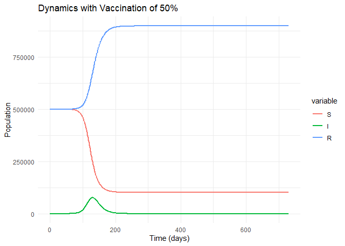<!-- -->

``` r
# 1. Parameter Definition
beta_val <- 0.4
gamma_val <- 0.1
N_total <- 1000000
v <- 0.70
# 2. Modified Initial Conditions
init_vaccine <- c(S = (1 - v) * N_total - 1, 
                  I = 1, 
                  R = v * N_total)
params_vaccine <- c(beta = beta_val, gamma = gamma_val)
times_vaccine <- seq(0, 365*2, by = 1) # 2 years
# 3. Simulation
output_vaccine <- as.data.frame(ode(y = init_vaccine, 
                                    times = times_vaccine, 
                                    func = sir_model, 
                                    parms = params_vaccine))
# 4. Visualization
ggplot(melt(output_vaccine, id="time"), aes(x=time, y=value, col=variable)) +
  geom_line(linewidth=1) +
  theme_minimal() +
  labs(title = paste0("Dynamics with Vaccination of ", v*100, "%"),
       y = "Population",
       x = "Time (days)")
```

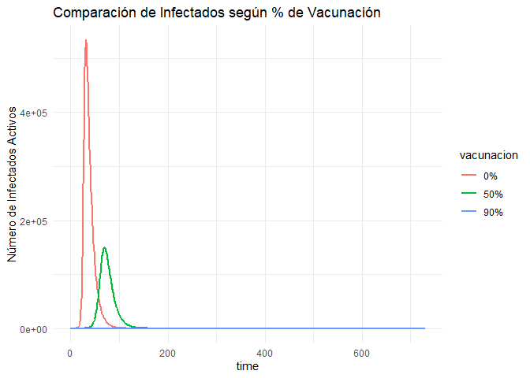<!-- -->

``` r
# 1. Parameter Definition
beta_val <- 0.4
gamma_val <- 0.1
N_total <- 1000000
v <- 0.75
# 2. Modified Initial Conditions
init_vaccine <- c(S = (1 - v) * N_total - 1, 
                  I = 1, 
                  R = v * N_total)
params_vaccine <- c(beta = beta_val, gamma = gamma_val)
times_vaccine <- seq(0, 365*2, by = 1) # 2 years
# 3. Simulation
output_vaccine <- as.data.frame(ode(y = init_vaccine, 
                                    times = times_vaccine, 
                                    func = sir_model, 
                                    parms = params_vaccine))
# 4. Visualization
ggplot(melt(output_vaccine, id="time"), aes(x=time, y=value, col=variable)) +
  geom_line(linewidth=1) +
  theme_minimal() +
  labs(title = paste0("Dynamics with Vaccination of ", v*100, "%"),
       y = "Population",
       x = "Time (days)")
```

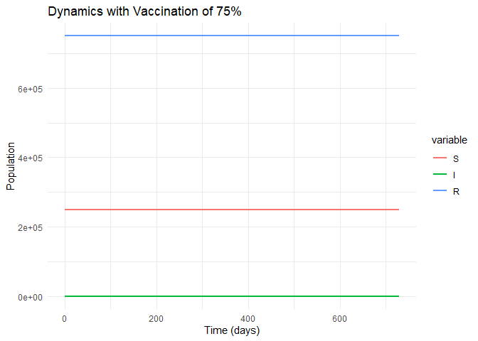<!-- -->

## Question 3

Make changes to the model to take into account that the population is
not constant:

add an increment term in $`dS`$ to take into account the born $`+bN`$

add a decrement term in $`dS`$ to take into account susceptible people
who die -$`\mu S`$

add a decrement term in $`dI`$ to take into account infected people who
die -$`\mu I`$

add a decrement term in $`dR`$ to take into account recovered people who
die $`-\mu R`$

Use the parameters
``` math

\begin{aligned}
\beta  &=  0.4 days^{-1} &= (0.4 \times 365) years^{-1}\\
\gamma &=  0.2 days^{-1} &= (0.2 \times 365) years^{-1}\\
\mu    &=  \frac{1}{70}years^{-1}\\
b     &=  \frac{1}{70}years^{-1}\\
\end{aligned}
```
and consider a duration of 400 years in your calculations.

``` r
# 1. Time Configuration
# We use a step of 1 day to maintain the resolution of oscillations,
# even if the horizon is 400 years.
times_long <- seq(0, 365*400, by = 1) 

# 2. Simulation

output_longterm <- as.data.frame(ode(y = initial_state_values, 
                                     times = times_long, 
                                     func = sir_vital_dynamics, 
                                     parms = parameters_p1))
# 3. Visualization
# We plot dividing time by 365 to see the X axis in "Years"
ggplot(melt(output_longterm, id="time"), aes(x=time/365, y=value, col=variable)) +
  geom_line(linewidth=0.8) +
  theme_minimal() +
  labs(title = "SIR Dynamics with Births and Deaths (Long Term)", 
       subtitle = "Convergence to Endemic Equilibrium",
       y = "Population",
       x = "Time (Years)",
       color = "Group")
```

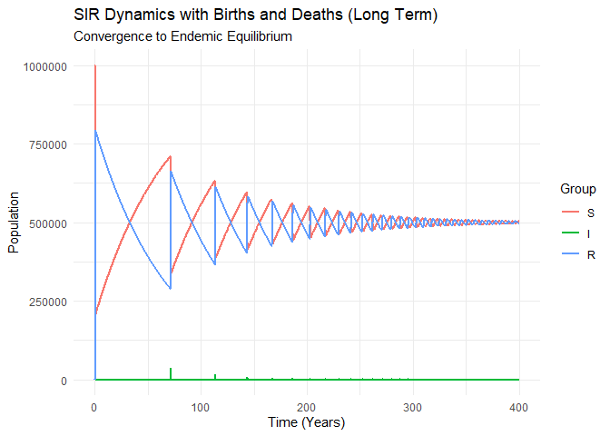<!-- -->

``` r
times_long <- seq(0, 365*200, by = 1) 

# 2. Simulation

output_longterm <- as.data.frame(ode(y = initial_state_values, 
                                     times = times_long, 
                                     func = sir_vital_dynamics, 
                                     parms = parameters_p1))
# 3. Visualization
# We plot dividing time by 365 to see the X axis in "Years"
ggplot(melt(output_longterm, id="time"), aes(x=time/365, y=value, col=variable)) +
  geom_line(linewidth=0.8) +
  theme_minimal() +
  labs(title = "SIR Dynamics with Births and Deaths (Long Term)", 
       subtitle = "Convergence to Endemic Equilibrium",
       y = "Population",
       x = "Time (Years)",
       color = "Group")
```

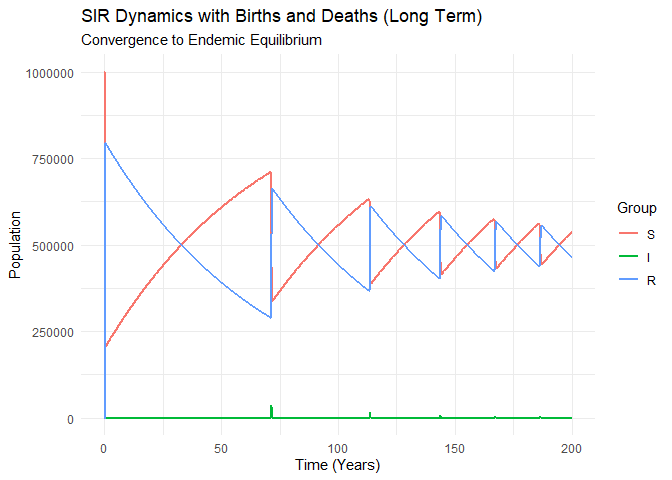<!-- -->

``` r
times_long <- seq(0, 365*100, by = 1) 

# 2. Simulation

output_longterm <- as.data.frame(ode(y = initial_state_values, 
                                     times = times_long, 
                                     func = sir_vital_dynamics, 
                                     parms = parameters_p1))
# 3. Visualization
# We plot dividing time by 365 to see the X axis in "Years"
ggplot(melt(output_longterm, id="time"), aes(x=time/365, y=value, col=variable)) +
  geom_line(linewidth=0.8) +
  theme_minimal() +
  labs(title = "SIR Dynamics with Births and Deaths (Long Term)", 
       subtitle = "Convergence to Endemic Equilibrium",
       y = "Population",
       x = "Time (Years)",
       color = "Group")
```

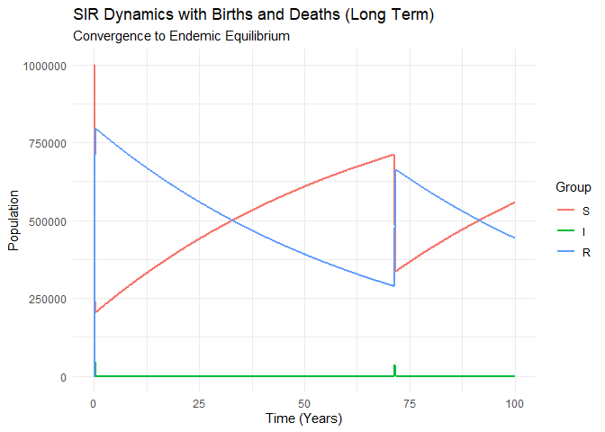<!-- -->

``` r
times_long <- seq(0, 365*50, by = 1) 

# 2. Simulation

output_longterm <- as.data.frame(ode(y = initial_state_values, 
                                     times = times_long, 
                                     func = sir_vital_dynamics, 
                                     parms = parameters_p1))
# 3. Visualization
# We plot dividing time by 365 to see the X axis in "Years"
ggplot(melt(output_longterm, id="time"), aes(x=time/365, y=value, col=variable)) +
  geom_line(linewidth=0.8) +
  theme_minimal() +
  labs(title = "SIR Dynamics with Births and Deaths (Long Term)", 
       subtitle = "Convergence to Endemic Equilibrium",
       y = "Population",
       x = "Time (Years)",
       color = "Group")
```

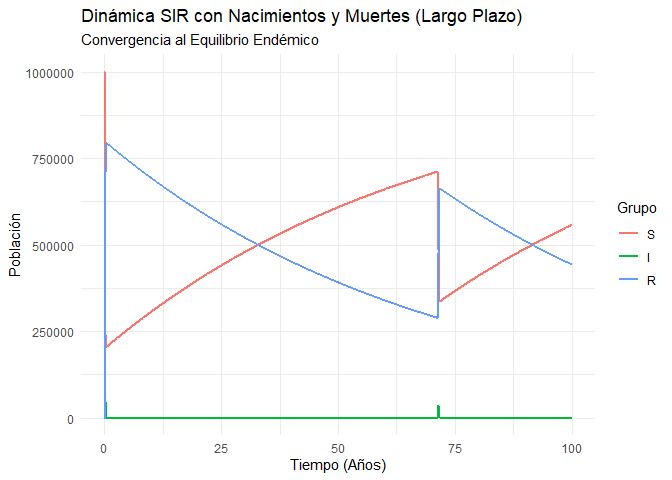<!-- --> \###
Graphic animation 400 years (run locally on your computer)

## Question 4

Considering the basic SIR model, make changes to take into account a
vaccination program. Assume that a fraction $`v`$ of susceptibles is
vaccinated so that they become immune (and now enter directly into the
set of recovered), while the fraction $`(1-v)`$ remains susceptible.

Calculate the dynamics of the epidemic in this case, studying how the
dynamics change by varying the fraction $`v`$. Use $`\beta=0.6`$,
$`\gamma=0.1`$ and consider a period of 2 years.

Your model should be able to show that if the fraction $`v`$ is
sufficient, it is not necessary to vaccinate all susceptibles to avoid
the epidemic. This effect is known as herd immunity and refers to the
fact that if a large sector of the population is immune, then contagions
are kept at a level where the disease is eliminated.

How can the minimum fraction $`v`$ of people to be vaccinated be
calculated to avoid an epidemic? Herd immunity occurs when
$`R_{eff}< 1`$

*Analytical Analysis of the Threshold*:

In this case, the parameters have changed to $`\beta=0.6`$ and
$`\gamma=0.1`$. This modifies the basic reproductive number:

``` math
R_0 = \frac{0.6}{0.1} = 6
```

To achieve herd immunity ($`R_{eff} < 1`$), we calculate the new minimum
fraction $`v`$:

``` math
v > 1 - \frac{1}{R_0} = 1 - \frac{1}{6} \approx 0.833
```

*Interpretation*: With these new parameters, *it is necessary to
vaccinate 83.3%* of the population to avoid the epidemic.

This means that the requested scenario of *75% will not be sufficient*
to stop the outbreak completely (although it will reduce it), and *we
will need a higher percentage 84%* to observe total elimination.

``` r
# Parameter Definition
N_total <- 1000000
params_p4 <- c(beta=0.6, gamma=0.1)
times_p4 <- seq(0, 365*2, 1) # 2 years

# Vaccination scenarios: 
# We add 0.84 and 0.95 to see the effect of herd immunity (>83.3%)
v_scenarios <- c(0, 0.5, 0.75, 0.84, 0.95)

results_list <- list()

# Loop to simulate each scenario
for(v in v_scenarios){
  # Initial conditions:
  # We move the percentage 'v' directly to Recovered
  y_init <- c(S = (1-v)*N_total - 1, 
              I = 1, 
              R = v*N_total)
  
  # Assuming that 'sir_model' function is already defined in previous chunks
  out <- as.data.frame(ode(y=y_init, times=times_p4, func=sir_model, parms=params_p4))
  
  # Label the scenario for the plot
  out$vacunacion <- factor(paste0(v*100, "%"), 
                           levels = paste0(v_scenarios*100, "%")) # Order factors
  results_list[[length(results_list)+1]] <- out
}

# Bind all data
all_results <- do.call(rbind, results_list)
```

``` r
ggplot(all_results, aes(x=time, y=S, color=vacunacion)) +
  geom_line(linewidth=1) +
  theme_minimal() +
  labs(title = "Dynamics of Susceptibles",
       subtitle = "Beta = 0.6, Gamma = 0.1 (R0 = 6)",
       y = "Susceptible Population",
       x = "Time (days)",
       color = "% Vaccinated")
```

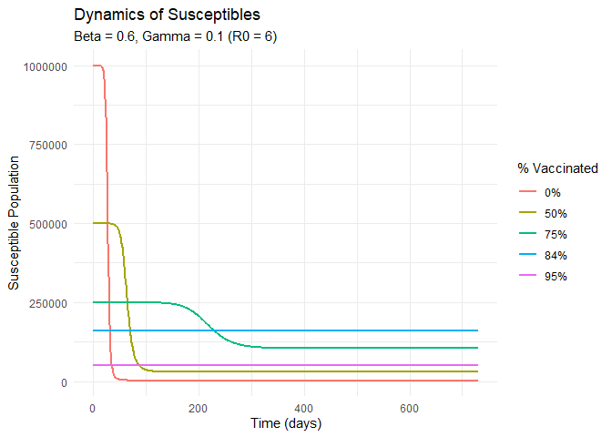<!-- -->

``` r
ggplot(all_results, aes(x=time, y=I, color=vacunacion)) +
  geom_line(linewidth=1) +
  theme_minimal() +
  labs(title = "Dynamics of Infected",
       y = "Active Infected",
       x = "Time (days)",
       color = "% Vaccinated")
```

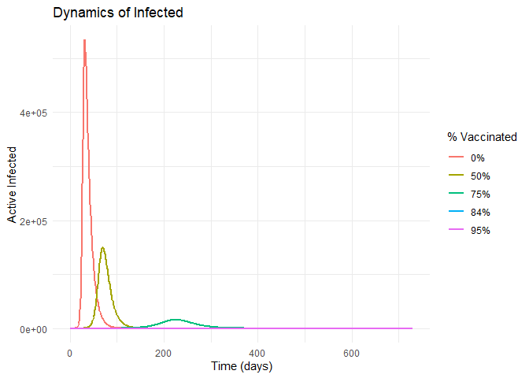<!-- -->

``` r
ggplot(all_results, aes(x=time, y=R, color=vacunacion)) +
  geom_line(linewidth=1) +
  theme_minimal() +
  labs(title = "Dynamics of Recovered (Immune)",
       subtitle = "Includes initial vaccinated + natural recovered",
       y = "Immune Population",
       x = "Time (days)",
       color = "% Vaccinated")
```

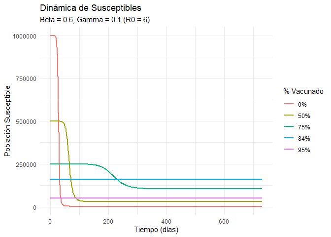<!-- -->
